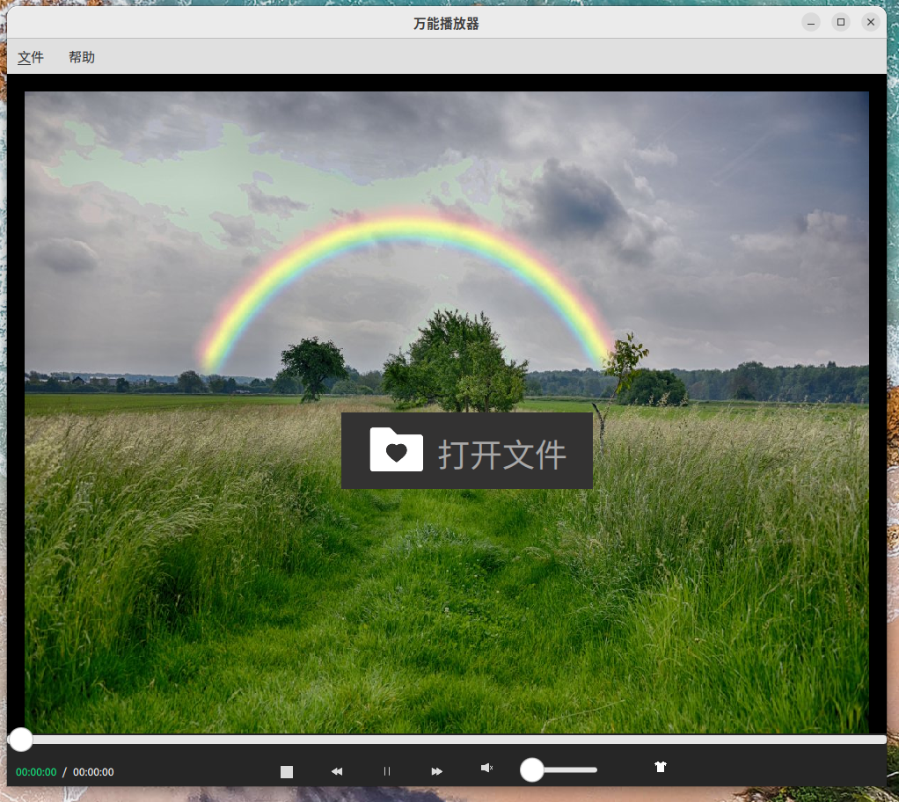
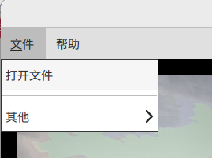
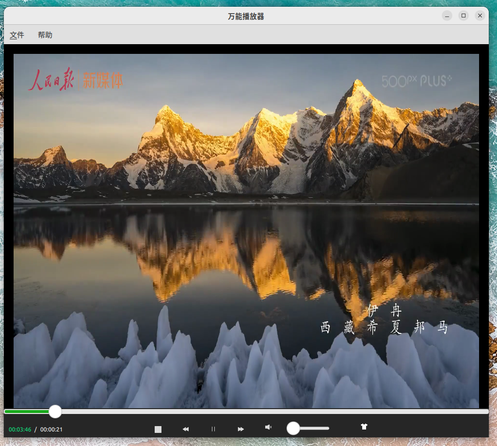
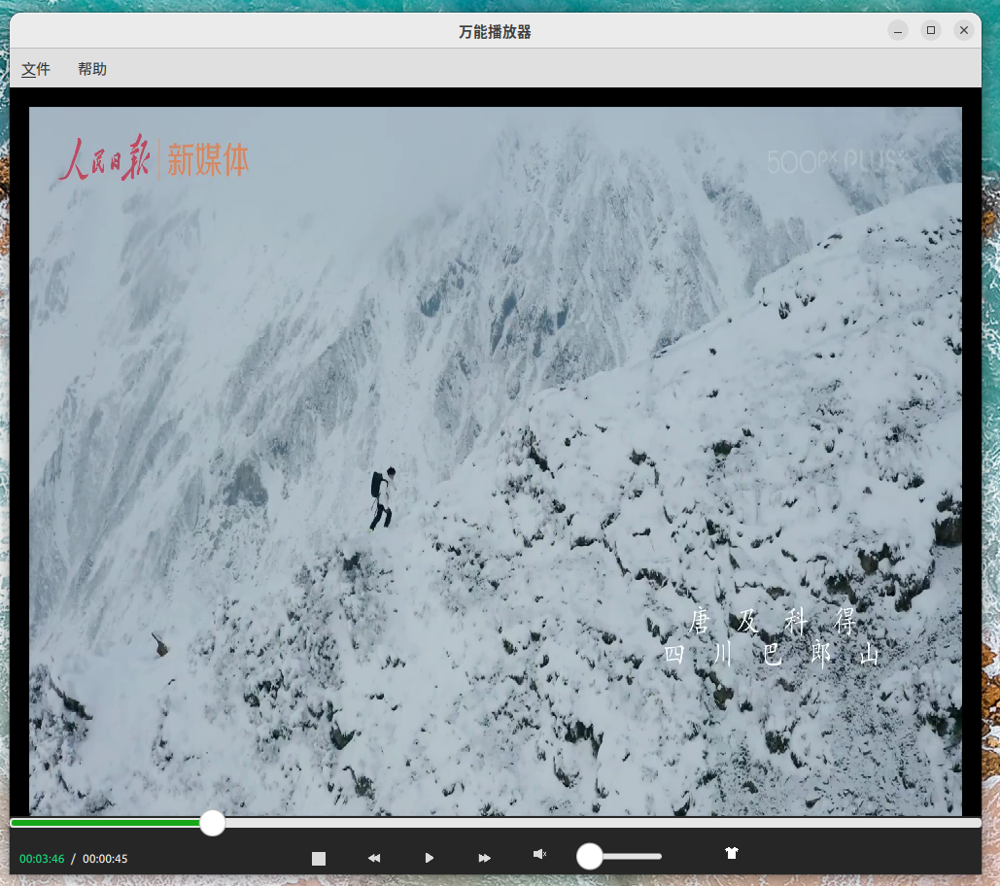
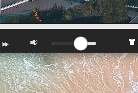
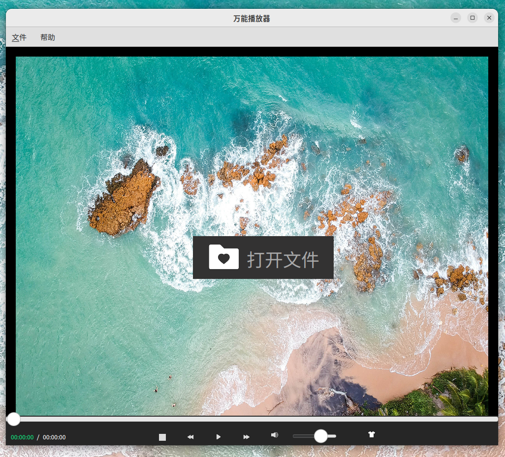

# QT + FFmpeg 5.x + x264 + x265 + SDL2 音视频播放器

使用了QT的QML设计界面,人机交互;

使用了FFmpeg 5.x  + x264 + x265 + SDL2 完成了音视频的解析到播放;

阅读了ffplay的源码,用到了ffplay的核心思想.

想熟悉ffmpeg和ffplay的朋友,都可以参考学习.

# 展示图

## 1.主界面

## 2.通过中心的按钮选择媒体文件

## 3.通过菜单打开文件

## 4.开始播放

## 5.暂停播放

## 6.继续播放

## 7.快进

可以想象一下,截图没效果

## 8.快退

可以想象一下,截图没效果

## 9.静音

## 10.调整音量

## 11. 时时进度条和时间显示

## 12.停止播放

停止后,又回来了

## 13.切换背景图

切换背景的按钮

点击后选择图片

切换后:

# 使用技术

编程语言：C、C++；

主要技术：QT5+qml；

视频相关：ffmpeg，视频解码；

多线程等。

# 记录

2021.12.7 :

可以暂停和开始播放了；

停止播放还存在问题，明天需要解决。

2021.12.8：

1、支持了停止播放的功能；

2、计算出来了总时间，还未显示到UI中。

3、明天需要显示到UI中，然后计算正在播放的时间。

2021.12.9: 1、UI中可以显示出来视频的总时间； 2、UI中显示出来了正在播放的时间（感觉不太准，有待提高）；

2022.11.4:终于有时间来完结了

## version 1.0.0

> 基础版本提交.
>
> 2022.12.4

+ 1.音量控制(音量控制条拖动,音量静音);

+ 2.停止播放;
+ 3.快退播放;
+ 4.快进播放;
+ 5.暂停播放;
+ 6.继续播放;
+ 7.总时间/当前播放时间进度显示;
+ 8.时时进度条;
+ 9.进度条拖动控制播放;
+ 10.通过UI中心打开视频文件/通过菜单打开视频文件;
